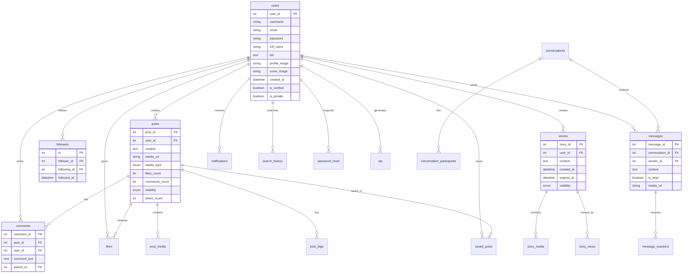
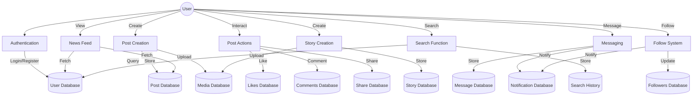
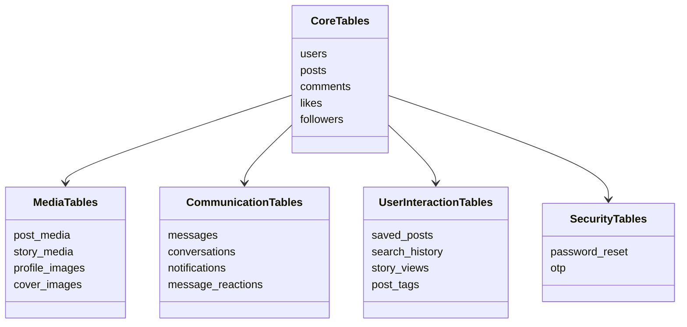

# Spheria Database Architecture

## Entity Relationship Diagram (ERD)

```mermaid
erDiagram
    users ||--o{ posts : creates
    users ||--o{ comments : writes
    users ||--o{ likes : gives
    users ||--o{ followers : follows
    users ||--o{ stories : creates
    users ||--o{ messages : sends
    users ||--o{ notifications : receives
    users ||--o{ saved_posts : saves
    users ||--o{ search_history : searches
    users ||--o{ password_reset : requests
    users ||--o{ otp : generates

    posts ||--o{ comments : has
    posts ||--o{ likes : receives
    posts ||--o{ post_media : contains
    posts ||--o{ post_tags : has
    posts ||--o{ saved_posts : saved_in

    stories ||--o{ story_media : contains
    stories ||--o{ story_views : viewed_by

    conversations ||--o{ messages : contains
    conversations ||--o{ conversation_participants : has
    messages ||--o{ message_reactions : receives

    users {
        int user_id PK
        string username
        string email
        string password
        string full_name
        text bio
        string profile_image
        string cover_image
        datetime created_at
        boolean is_verified
        boolean is_private
    }

    posts {
        int post_id PK
        int user_id FK
        text content
        string media_url
        enum media_type
        int likes_count
        int comments_count
        enum visibility
        int share_count
    }

    comments {
        int comment_id PK
        int post_id FK
        int user_id FK
        text comment_text
        int parent_id FK
    }

    stories {
        int story_id PK
        int user_id FK
        text content
        datetime created_at
        datetime expires_at
        enum visibility
    }

    messages {
        int message_id PK
        int conversation_id FK
        int sender_id FK
        text content
        boolean is_read
        string media_url
    }

    followers {
        int id PK
        int follower_id FK
        int following_id FK
        datetime followed_at
    }
```

## Data Flow Diagram

```mermaid
flowchart TD
    User((User)) --> Auth[Authentication]
    Auth -->|Login/Register| UserDB[(User Database)]
    
    User -->|Create| Post[Post Creation]
    Post -->|Store| PostDB[(Post Database)]
    Post -->|Upload| MediaDB[(Media Database)]
    
    User -->|View| Feed[News Feed]
    Feed -->|Fetch| PostDB
    Feed -->|Fetch| UserDB
    
    User -->|Interact| Actions[Post Actions]
    Actions -->|Like| LikeDB[(Likes Database)]
    Actions -->|Comment| CommentDB[(Comments Database)]
    Actions -->|Share| ShareDB[(Share Database)]
    
    User -->|Create| Story[Story Creation]
    Story -->|Store| StoryDB[(Story Database)]
    Story -->|Upload| MediaDB
    
    User -->|Message| Chat[Messaging]
    Chat -->|Store| MessageDB[(Message Database)]
    Chat -->|Notify| NotificationDB[(Notification Database)]
    
    User -->|Search| Search[Search Function]
    Search -->|Query| UserDB
    Search -->|Store| SearchDB[(Search History)]
    
    User -->|Follow| Follow[Follow System]
    Follow -->|Update| FollowDB[(Followers Database)]
    Follow -->|Notify| NotificationDB
```

## Database Tables Overview

```mermaid
classDiagram
    class CoreTables {
        users
        posts
        comments
        likes
        followers
    }
    
    class MediaTables {
        post_media
        story_media
        profile_images
        cover_images
    }
    
    class CommunicationTables {
        messages
        conversations
        notifications
        message_reactions
    }
    
    class UserInteractionTables {
        saved_posts
        search_history
        story_views
        post_tags
    }
    
    class SecurityTables {
        password_reset
        otp
    }
    
    CoreTables --> MediaTables
    CoreTables --> CommunicationTables
    CoreTables --> UserInteractionTables
    CoreTables --> SecurityTables
``` 