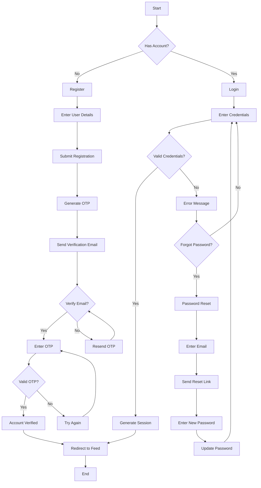
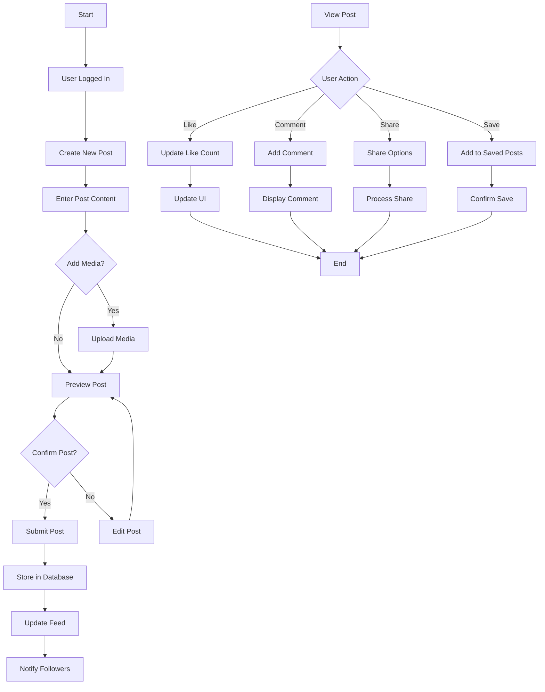
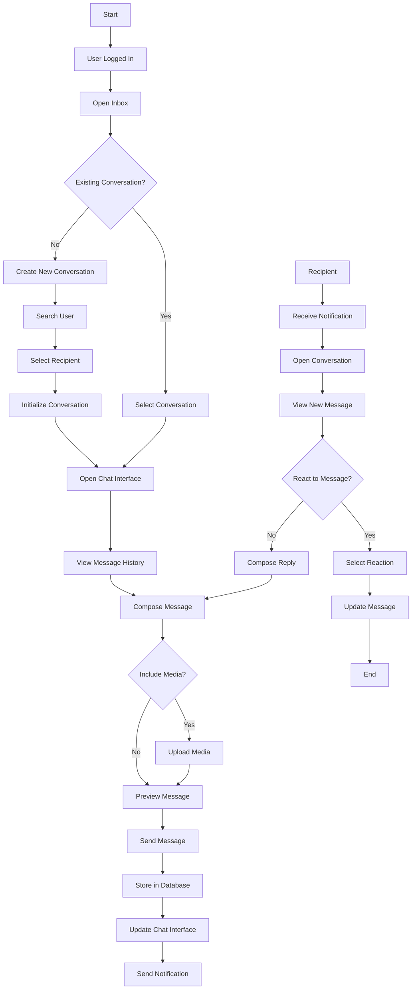
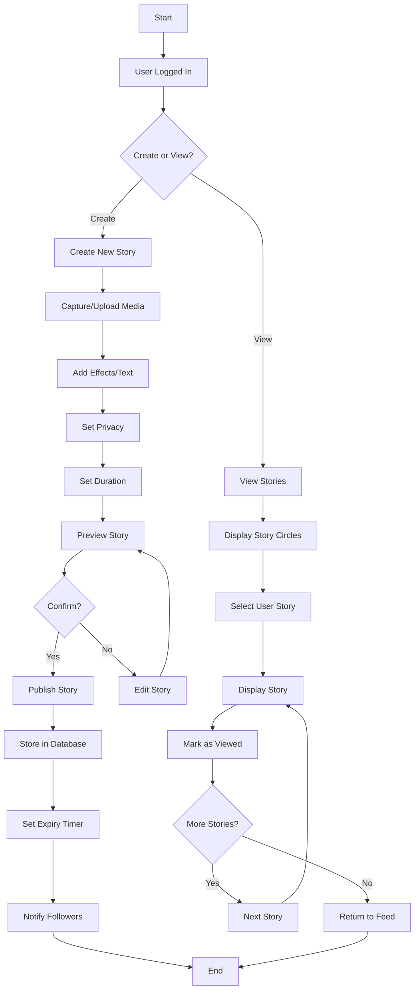
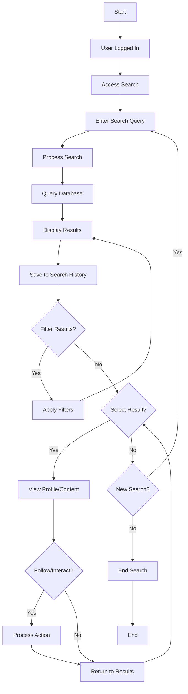

# Spheria Project Diagrams

## Use Case Diagram

```mermaid
graph TD
    subgraph "Spheria Social Media Platform"
        subgraph "User Management"
            UC1[Register Account]
            UC2[Login]
            UC3[Update Profile]
            UC4[Manage Privacy Settings]
            UC5[Reset Password]
            UC6[Verify Account]
        end
        
        subgraph "Content Management"
            UC7[Create Post]
            UC8[Upload Media]
            UC9[Create Story]
            UC10[Delete Content]
            UC11[Edit Content]
        end
        
        subgraph "Social Interactions"
            UC12[Follow User]
            UC13[Like Post]
            UC14[Comment on Post]
            UC15[Share Post]
            UC16[Save Post]
            UC17[View Stories]
        end
        
        subgraph "Communication"
            UC18[Send Message]
            UC19[Create Conversation]
            UC20[React to Message]
            UC21[View Notifications]
        end
        
        subgraph "Discovery"
            UC22[Search Users]
            UC23[View Feed]
            UC24[Explore Trending]
        end
    end
    
    User((User)) --> UC1
    User --> UC2
    User --> UC3
    User --> UC4
    User --> UC5
    User --> UC6
    User --> UC7
    User --> UC8
    User --> UC9
    User --> UC10
    User --> UC11
    User --> UC12
    User --> UC13
    User --> UC14
    User --> UC15
    User --> UC16
    User --> UC17
    User --> UC18
    User --> UC19
    User --> UC20
    User --> UC21
    User --> UC22
    User --> UC23
    User --> UC24
```

## User Authentication Flow

## Post Creation and Interaction Flow

## Messaging System Flow

## Story Creation and Viewing Flow

## Search and Discovery Flow

